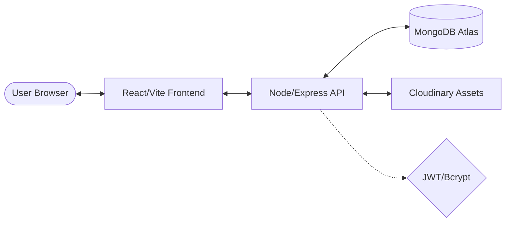
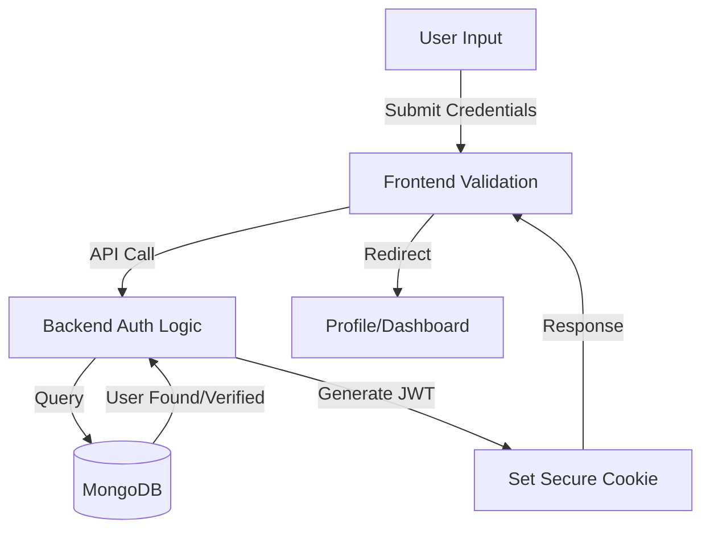
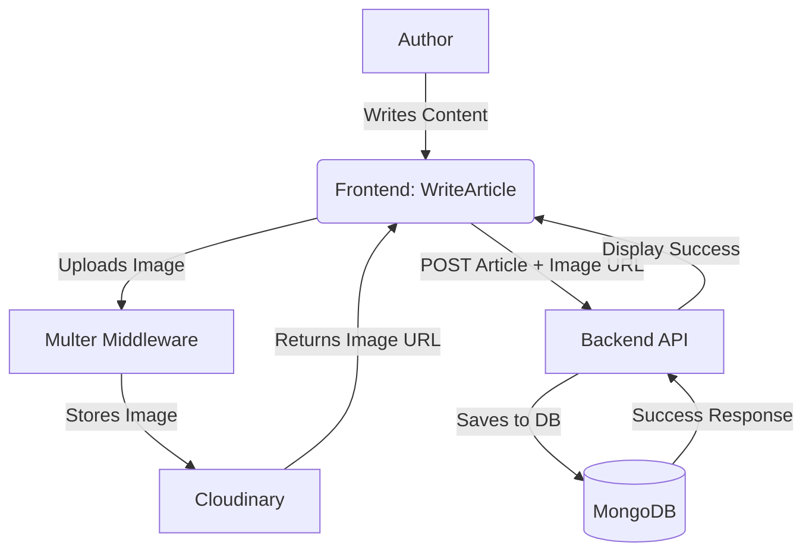
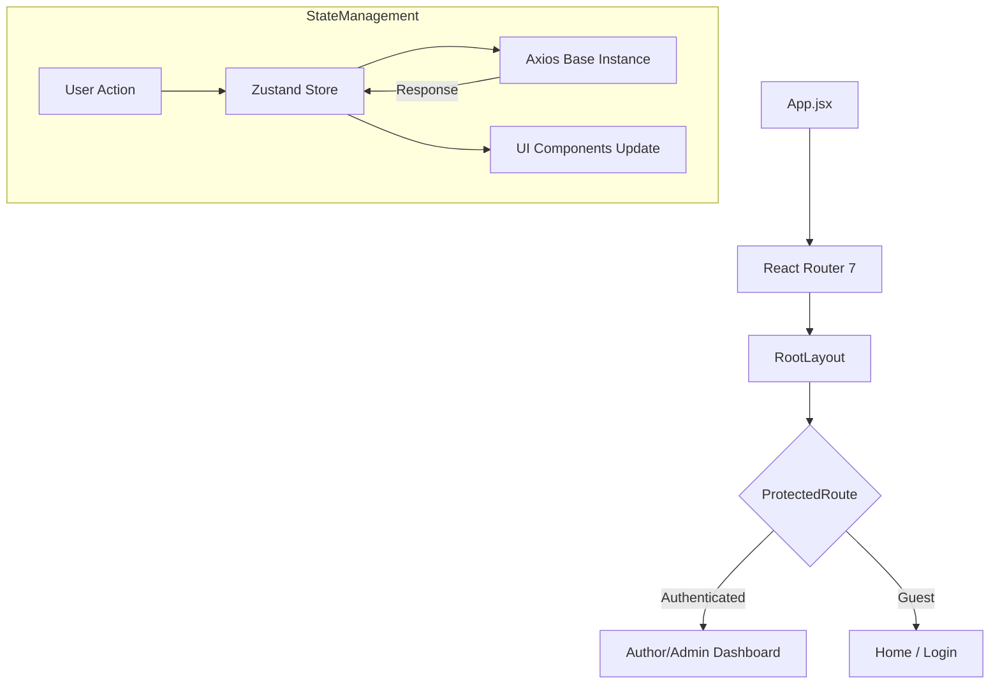
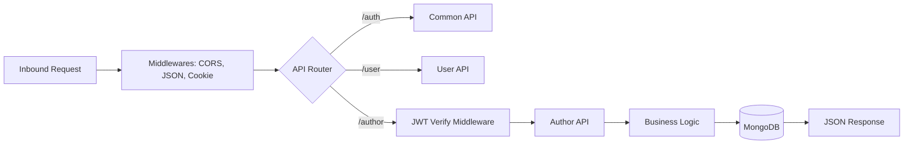

# BlogApp - Full Stack MERN Application 

**BlogApp** is a sophisticated, full-stack MERN application designed to bridge the gap between content creators and readers. Unlike simple blogging platforms, this application implements a tiered access system with specialized roles for **Users, Authors, and Administrators**, ensuring a secure and organized environment for digital storytelling.

The platform provides a seamless end-to-end experience:
- **For Readers:** A clean, responsive interface to discover and engage with high-quality articles.
- **For Authors:** A powerful content management dashboard with integrated image hosting to bring stories to life.
- **For Admins:** A centralized control hub to oversee platform activity and maintain content integrity.

Built with performance and security in mind, BlogApp leverages modern technologies like **React 19, Tailwind CSS 4, and JWT-based authentication** to provide a premium user experience that is both fast and secure.

## Tech Stack & Rationale

| Technology | Purpose | Why it is used? |
| :--- | :--- | :--- |
| **MongoDB** | Database | NoSQL database for flexible document storage, ideal for blog posts with varying structures. |
| **Express.js** | Backend Framework | Minimalist and fast web framework for Node.js to handle API routing and middleware. |
| **React.js** | Frontend Library | Component-based UI library for building a dynamic, high-performance user interface. |
| **Node.js** | Runtime Environment | Scalable JavaScript runtime for building fast and efficient network applications. |
| **Tailwind CSS 4** | Styling | Utility-first CSS framework for rapid and consistent modern UI development. |
| **Zustand** | State Management | Lightweight and simple state management for handling global user sessions and app state. |
| **Cloudinary** | Image Hosting | Cloud-based service for optimized image storage, transformation, and fast delivery. |
| **JWT** | Security | JSON Web Tokens for secure, stateless authentication across the platform. |

## System Architecture



## Key Features

- **Multi-Role System:** Support for regular Users, Content Authors, and System Admins.
- **Secure Authentication:** JWT-based authentication with secure cookie storage.
- **Content Management:** Full article lifecycle management (Create, Read, Update, Delete).
- **Responsive Design:** A mobile-first approach using Tailwind CSS.
- **Image Support:** Integrated image uploading and hosting via Cloudinary.

## Repository Structure

```text
blogApp/
├── Backend/          # Node.js API server
│   ├── APIs/         # Route handlers
│   ├── models/       # Database schemas
│   └── server.js     # Entry point
├── Frontend/         # React application
│   ├── src/          # Source code
│   └── public/       # Static assets
└── README.md         # This file
```

## Getting Started

### Prerequisites

- Node.js installed on your machine.
- A MongoDB database (Local or Atlas).
- A Cloudinary account for image storage.

### Installation Steps

1. **Clone the project:**
   ```bash
   git clone <repository-url>
   cd blogApp
   ```

2. **Setup Backend:**
   - Refer to [Backend/README.md](./Backend/README.md) for detailed configuration.
   - Run `npm install` and `npm start` in the `Backend` folder.

3. **Setup Frontend:**
   - Refer to [Frontend/README.md](./Frontend/README.md) for detailed configuration.
   - Run `npm install` and `npm run dev` in the `Frontend` folder.

## Data Flow

### 1. Authentication Flow


### 2. Article Management Flow


### 3. Frontend Internal Flow


### 4. Backend Internal Flow


## Command Reference

For quick setup and execution, use these commands:

### Backend Commands
| Task | Command |
| :--- | :--- |
| **Install Dependencies** | `cd Backend && npm install` |
| **Start Server** | `cd Backend && npm start` |

### Frontend Commands
| Task | Command |
| :--- | :--- |
| **Install Dependencies** | `cd Frontend && npm install` |
| **Run Development Server** | `cd Frontend && npm run dev` |
| **Build for Production** | `cd Frontend && npm run build` |

## Security & Best Practices

- **Stateless Auth:** Uses JWT (JSON Web Tokens) stored in secure, HTTP-only cookies to prevent XSS attacks.
- **Data Protection:** Passwords are never stored in plain text; they are hashed using **BcryptJS** with a high salt round.
- **Role Verification:** Backend middleware verifies the user's role before granting access to sensitive Author/Admin APIs.
- **Environment Isolation:** Sensitive credentials (DB URLs, API keys) are strictly managed via `.env` files and never committed to version control.
- **CORS Protection:** Cross-Origin Resource Sharing is configured to only allow requests from authorized frontend domains.

## Deployment Guide

### Backend (Render)
1. Create a new "Web Service" on Render.
2. Connect your GitHub repository.
3. Set the Build Command: `cd Backend && npm install`.
4. Set the Start Command: `cd Backend && npm start`.
5. Add all `.env` variables in the "Environment" tab.

### Frontend (Vercel)
1. Create a new project on Vercel.
2. Select the `Frontend` folder as the root.
3. Configure the Framework Preset to "Vite".
4. Add `VITE_API_BASE_URL` in the Environment Variables section.
5. Deploy.

## Contributing

Contributions, issues, and feature requests are welcome! Feel free to check the issues page or fork the repository to make improvements.
